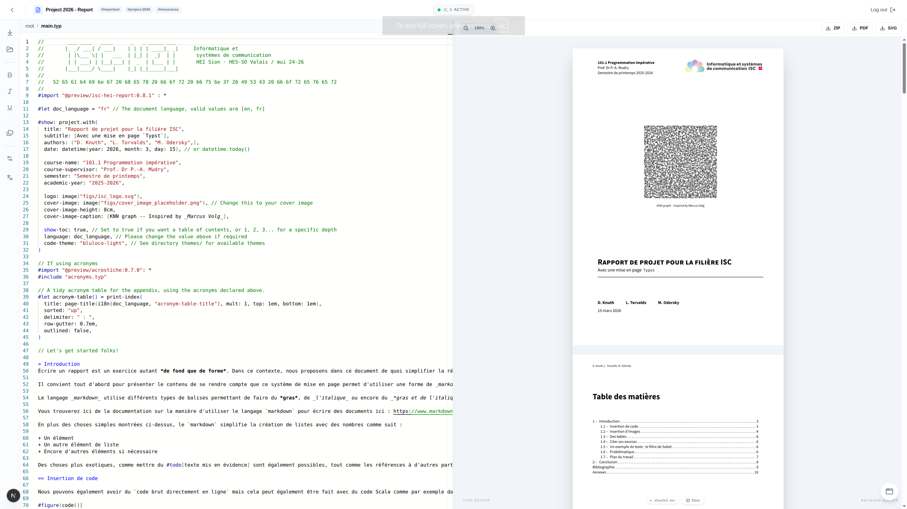
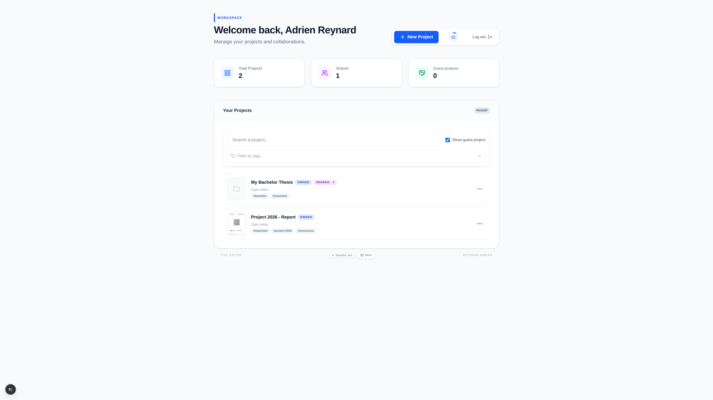
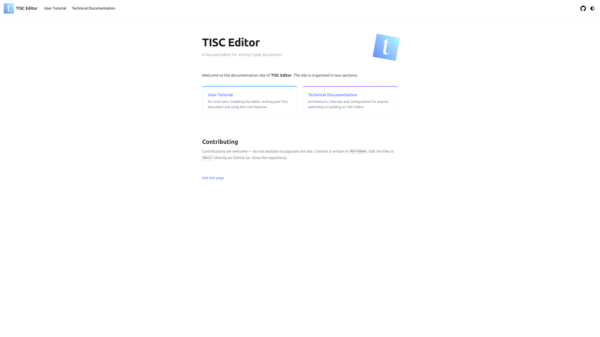
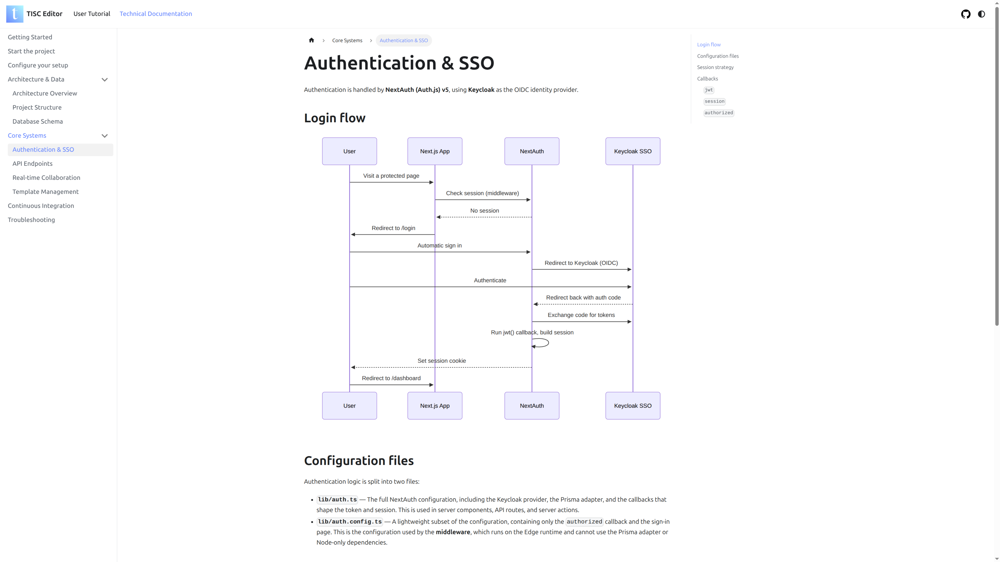
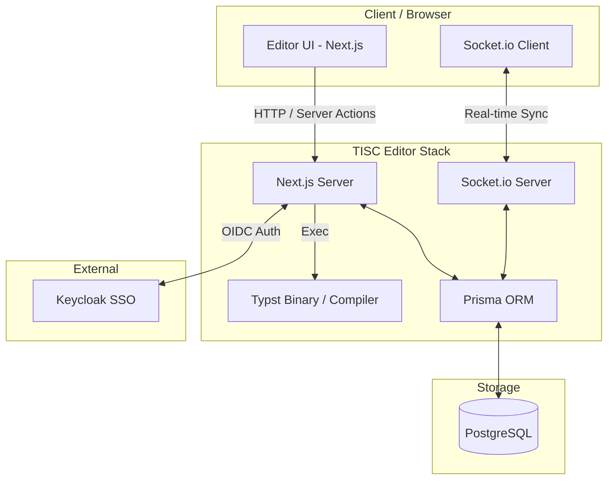

<picture>
  <source media="(prefers-color-scheme: dark)" srcset="https://raw.githubusercontent.com/ISC-HEI/isc-logos/main/white/ISC%20Logo%20inline%20white%20v3%20-%20large.webp">
  
</picture>

<div align="center">
    
    <h1>
        TISC Editor
    </h1>
  
  <p><strong>A full-stack solution for cloud-based Typst authoring.</strong></p>

  <div>
    
    
    
    
    
  </div>

  <br />

  [Documentation](https://tisc.isc-vs.ch/docs/) • [Website URL](https://tisc.isc-vs.ch) • [Report Bug](https://github.com/ISC-HEI/tisc-editor/issues)
</div>

<br />

<div align="center">
  <table>
    <tr>
      <td width="50%"></td>
      <td width="50%"></td>
    </tr>
    <tr>
      <td width="50%"></td>
      <td width="50%"></td>
    </tr>
  </table>
</div>

<br />

## 👉 [Use the application](https://tisc.isc-vs.ch)

## Overview

TISC Editor is a **Dockerized repo** providing a professional environment for cloud-based Typst editing:

- **Web Editor:** VSCode-like interface, live preview, template gallery, collaboration.
- **Compilation API:** Stateless Typst to PDF/SVG rendering, Base64 asset handling.
- **Database Layer:** PostgreSQL managed with Prisma ORM.
- **Documentation:** User and technical documentation, built with Docusaurus.
- **CI/CD:** Automated build, formatting and linting checks on every push and pull request via GitHub Actions.

## Documentation

The project ships with a full **Docusaurus documentation site**, covering both the user-facing features and the technical internals of the project.

- **[User Tutorial](https://tisc.isc-vs.ch/docs/docs/tutorial/intro)** — How to use the editor: login, project management, collaboration, file management, compilation, export.
- **[Technical Documentation](https://tisc.isc-vs.ch/docs/docs/techdocs/intro)** — Architecture, project structure, database schema, authentication, API reference, real-time collaboration, CI, and troubleshooting.

The documentation source lives under [`docs/`](./docs) and is deployed alongside the app (see [Production Deployment](#production-deployment)).

### Running the docs locally

```bash
cd docs
bun install
bun run start
```

The documentation will be available at `http://localhost:3001`.

> Running the full stack via `docker-compose-dev.yml` also starts the docs automatically, and is accessible via the `/docs/`

## Tech Stack

| Layer         | Technology |
|---------------|------------|
| Frontend      | Next.js 16, TailwindCSS, Lucide Icons, Socket.io-client |
| Backend       | Node.js API with Typst binary integration, Socket.io-server |
| Database      | PostgreSQL, Prisma ORM |
| Documentation | Docusaurus |
| DevOps        | Docker Compose, GitHub Actions |


## Key Features

| Component | Highlights |
| :--- | :--- |
| **Web Editor** | Multi-user editing with content synchronization, active users presence, and live notifications (Toasts). |
| **Compilation API** | Typst to PDF/SVG rendering, isolated environments, Base64 image processing |
| **Architecture** | Dockerized monorepo, Prisma ORM, Next.js Server Actions |


## Real-time Collaboration & Sync

TISC Editor uses a WebSocket layer (Socket.io) to enable seamless collaboration:

- **State Sync:** Automatic synchronization of the file tree and document content across all connected clients.
- **User Presence:** Real-time indicator of active collaborators on a project with a detailed hover-list of participant emails.
- **Smart Feedback:** Integrated notification system (Toasts) for user join/leave events and file system actions.

## Configuration & Environment
### GitHub API Rate Limiting (Template Gallery)

The editor fetches **Typst templates from public GitHub repositories** to enable template-based project creation.

This requires calling the **GitHub REST API** for:
- Searching repositories
- Reading repository metadata
- Fetching template files

By default, GitHub limits unauthenticated requests to **60 requests per hour per IP**.
This limit is quickly exceeded during normal usage (template browsing, searches, multiple users),
which may result in:
- Missing templates
- Failed searches
- GitHub API rate-limit errors (403)

To avoid this, you must configure a **Personal Access Token**.

### GitHub Token Setup

1. **Create a Token:** Go to https://github.com/settings/tokens and generate a
   **Personal Access Token (classic)**.  
   No special scopes are required for public repositories.

2. **Update your `.env`:** Add the token to the app environment file

```env
GITHUB_TOKEN=your_github_token_here
```
> **Note**: Using a token increases the rate limit to **5,000 requests** per hour. If you plan to use the API concurrently with multiple users, you may need to request a higher-tier token. See the details [here](https://docs.github.com/en/rest/using-the-rest-api/rate-limits-for-the-rest-api).

### Next.js Auth Secret

1. **Create a random secret**, you can generate one via `openssl rand -base64 32`
2. **Update your `.env`:** Add the secret to the app environment file

```env
AUTH_SECRET=your_auth_secret_here
```

### SSO Configuration

1. Add required variables in your `.env`

```env
AUTH_KEYCLOAK_ID=app-id
AUTH_KEYCLOAK_SECRET=app-secret
AUTH_KEYCLOAK_ISSUER=https://sso.isc-vs.ch/realms/isc
```

## Getting Started

### Prerequisites
- **Docker & Docker Compose** (Required)
- **Node.js / Bun** (Optional, for local development outside Docker)

### Development Deployment Docker
To launch the entire stack (App, API, Database, Docs):
> Make sure you completed the [Configuration](#configuration--environment) before.
```bash
git clone https://github.com/ISC-HEI/tisc-editor.git
cd tisc-editor
docker compose -f docker-compose-dev.yml up -d --build
```

* Editor UI: http://localhost:3000
* Documentation: http://localhost:3000/docs

### Development Workflow
<details>
<summary><strong>Option A - Docker Compose (recommended)</strong></summary>

For active development, we recommend using the following command to see live logs while you code:
```bash
docker compose -f docker-compose-dev.yml up --build
```

</details>

<details>
<summary><strong>Option A - Docker Compose (recommended)</strong></summary>

Please see the [official documentation](https://tisc.isc-vs.ch/docs/docs/techdocs/deployment)

</details>

## Production Deployment

In production, deployment is **fully automatic**: there is no need to run any script manually. Merging (or pushing) to `main` is enough.

### Prerequisites

- A `.env` file at the project root

> See the [Configuration & Environment](#configuration--environment) section for details on these variables. (or the .env.example)


### How it works

A `systemd` timer on the production LXC runs `scripts/check_and_deploy.sh` every minute:

1. It compares the remote SHA of `main` (`git ls-remote`) with the last deployed SHA (stored in `/var/lib/tisc-editor/last_deployed_sha`).
2. If nothing changed, it exits immediately.
3. If a new commit is detected, it runs `git fetch` + `git reset --hard origin/main`, then executes `publish_new_version.sh`.
4. On success, the new SHA is recorded. On failure, it is **not** recorded, so the deployment is retried automatically on the next tick.

A lock file (`flock`) prevents overlapping runs. The LXC polls GitHub, so no inbound connection from GitHub Actions is required.

> A new version is usually live within 5 to 6 minutes after the push to `main`, as the build and deployment process takes some time.

Full setup and troubleshooting: [Automatic Deployment documentation](https://tisc.isc-vs.ch/docs/docs/techdocs/automatic-deployment)

### What `publish_new_version.sh` does

This script is executed automatically by the mechanism above.

| Step | Action |
| :--- | :--- |
| **1. Versioning** | Determines the version from `git describe` (suffixed with the branch name if not `main`). |
| **2. Build** | Builds the Docker images for the app (`isc-hei/tis-editor`) and the docs (`isc-hei/tisc-docs`). |
| **3. Network** | Creates the `tisc-network` Docker network if it doesn't exist. |
| **4. Database** *(if `--db`)* | Starts PostgreSQL and waits for it to be ready (`pg_isready`). |
| **5. Application** | Starts the `tisc-app-prod` container and waits for the API to respond. |
| **6. Prisma** | Applies the database schema via `prisma db push`. |
| **7. Documentation** | Starts the `tisc-docs` container and waits for it to be ready. |
| **8. Reverse proxy** | Starts nginx (`tisc-nginx`) on port `8082`, routing traffic to the app and the docs according to `nginx/default.conf`. |

At each step, the script actively polls until the previous service is up before moving on, avoiding cascading startup failures.

### Access

- Application: `http://localhost:8082`
- Documentation: `http://localhost:8082/docs/`

### Monitoring

```bash
# Next scheduled run
systemctl list-timers tisc-deploy-check.timer

# Follow deployment logs live
journalctl -t tisc-deploy -f
```

### Manual deployment (initial setup / fallback only)

The automatic deployment runs the script **without** `--db`, so the database container must already exist. On a fresh server, run the first deployment manually:

```bash
./scripts/publish_new_version.sh --db
```

To force a redeploy without any code change:

```bash
rm /var/lib/tisc-editor/last_deployed_sha
systemctl start tisc-deploy-check.service
```

## CI/CD

The project uses **GitHub Actions** to automatically validate every push and pull request to `main`. Workflows live under `.github/workflows/`.

| Workflow | File | What it checks |
| :--- | :--- | :--- |
| **Build** | `build.yml` | Installs dependencies and runs `bun run build` from `app/` to make sure the project compiles. |
| **Format** | `format.yml` | Installs dependencies and runs `bun run format:check` (Prettier) from `app/` to make sure the codebase is consistently formatted. |
| **Lint** | `lint.yml` | Installs dependencies and runs `bun run lint` (ESLint) from `app/` to verify that the codebase meets the project's linting rules. |
| **Build Docs** | `build-docs.yml` | Installs dependencies and runs `bun run build` from `docs/` to make sure the documentation site compiles. |
| **Check changelog updated** | `check_changelog.yml` | Check that on PR the changelog has been updated (bypass by adding `no-changelog`) |

A local **pre-commit hook** (via Husky) also runs `bun run format:check`, `bun run lint` and `bun run typecheck` before each commit, so issues are caught before code even reaches CI.

## Diagram



## License
This project is licensed under the Apache License, Version 2.0. See the [LICENSE](LICENSE) file for details.

## Disclaimer
This project is an independent work and is not affiliated with, endorsed by, or supported by the official Typst organization.
