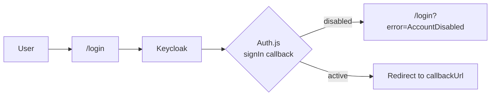

# User management

The admin dashboard lets instance administrators manage user accounts: view all users, edit their storage quota, and enable or disable their access.

:::note
This page is only available to administrators. Non-admin users are redirected to `/dashboard`.
:::

## Overview

| Feature            | Description                                               |
| ------------------ | --------------------------------------------------------- |
| List users         | Name, email, creation date, quota and status of each user |
| Edit storage quota | Set the quota per user, in MB                             |
| Disable / enable   | Block or restore a user's access to the editor            |

The page is available at `/admin` and is linked from the **Admin** button on the main dashboard.

## Access control

Access is checked on two levels:

1. **Page**: `app/admin/page.tsx` redirects to `/login` if there is no valid session, and to `/dashboard` if `session.user.isAdmin` is false.
2. **Server actions**: every action in `lib/actions/admin.ts` calls `requireAdmin()` before touching the database.

:::warning
Server actions are public HTTP endpoints. The check in the page is not enough, which is why each action verifies the caller's role itself.
:::

## Storage quota

- The quota is stored in **bytes** in `User.storageQuota` (`Int`, default `10485760`, i.e. 10 MB).
- The UI displays and edits the value in **MB**.
- The maximum value is `2147483647` bytes (about 2 GiB), the limit of a PostgreSQL `Int`. Higher values are rejected with an `Invalid quota` error.

:::tip
To allow quotas above 2 GiB, change `storageQuota` to `BigInt` in `schema.prisma` and convert the value before passing it to client components.
:::

## Disabling an account

When an admin disables a user:

1. `User.disabled` is set to `true`.
2. All of the user's rows in the `sessions` table are deleted, so they are logged out on their next request.
3. Any new sign-in attempt is refused by the Auth.js `signIn` callback.

Re-enabling an account only flips the flag back. The user can sign in again right away.

An admin **cannot disable their own account**. The button is disabled in the UI and the action throws an error if called directly.

## Sign-in flow for disabled users

The login page redirects automatically to Keycloak when there is no error. When `error` is present, it shows a message instead, to avoid an infinite redirect loop.

| `error` value     | Message shown                    | Retry button |
| ----------------- | -------------------------------- | ------------ |
| `AccountDisabled` | Account disabled                 | No           |
| `AccessDenied`    | Access denied                    | Yes          |
| any other value   | Generic "Sign-in failed" message | Yes          |

:::note
If the user still has an active Keycloak session, a retry signs them in again silently and the callback refuses them again. This is expected.
:::

## Server actions

All actions live in `lib/actions/admin.ts`.

| Action                           | Description                                              | Errors                                      |
| -------------------------------- | -------------------------------------------------------- | ------------------------------------------- |
| `getAllUsers()`                  | Returns all users (id, name, email, status, quota, date) | Not an admin                                |
| `setUserDisabled(userId, state)` | Enables or disables a user and revokes sessions          | Not an admin, user not found, self-disable  |
| `updateUserQuota(userId, bytes)` | Updates the storage quota                                | Not an admin, user not found, invalid quota |

Both mutating actions call `revalidatePath("/admin")` so the list refreshes without a manual reload.

## Components

| File                            | Role                                                     |
| ------------------------------- | -------------------------------------------------------- |
| `app/admin/page.tsx`            | Server component: auth check, data loading, stats, table |
| `components/Admin/user-row.tsx` | Client component: quota input, save and enable/disable   |
| `app/login/page.tsx`            | Login redirect and error display                         |
