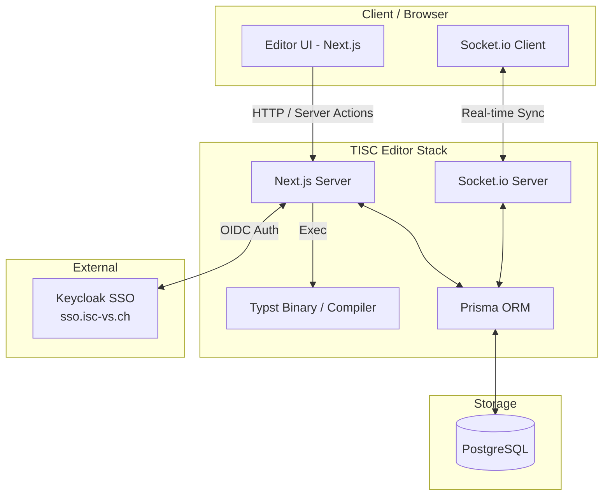

# Architecture Overview

This page gives a high-level overview of how the TISC Editor is built and how its main components interact.

## Diagram

The browser communicates with the Next.js server over HTTP and Server Actions for standard requests, while a dedicated Socket.io connection handles real-time synchronization between clients. On the server side, the Next.js server executes the Typst binary to compile documents and uses Prisma to read and write data in PostgreSQL. The Socket.io server also goes through Prisma to persist collaborative editing state. Authentication is delegated to an external Keycloak instance via OIDC, handled by NextAuth on the server.

## Tech Stack

### Framework & UI

| Technology | Usage |
| --- | --- |
| [Next.js](https://nextjs.org/) 16 | Application framework (frontend + backend API routes) |
| [React](https://react.dev/) 19 | UI library |
| [TailwindCSS](https://tailwindcss.com/) 4 | Styling |
| [Lucide](https://lucide.dev/) | Icon set |
| [Monaco Editor](https://microsoft.github.io/monaco-editor/) | Code editor component |
| [nextjs-toast-notify](https://www.npmjs.com/package/nextjs-toast-notify) | UI notifications |

### Authentication

| Technology | Usage |
| --- | --- |
| [NextAuth (Auth.js)](https://authjs.dev/) 5 | Authentication framework |
| Keycloak (OIDC) | SSO provider (`sso.isc-vs.ch`) |
| `@auth/prisma-adapter` | Persists sessions and accounts via Prisma |

### Compilation & Documents

| Technology | Usage |
| --- | --- |
| [Typst](https://typst.app/) (`@myriaddreamin/typst-ts-node-compiler`) | Compiles `.typ` files to SVG |
| `jszip` | Generates ZIP archives for project export |

### Real-time Collaboration

| Technology | Usage |
| --- | --- |
| [Socket.io](https://socket.io/) / `socket.io-client` | Real-time sync between collaborators |

### Database

| Technology | Usage |
| --- | --- |
| PostgreSQL | Primary datastore |
| [Prisma](https://www.prisma.io/) 7 (`@prisma/client`, `@prisma/adapter-pg`) | ORM and database driver |

### Tooling & DevOps

| Technology | Usage |
| --- | --- |
| TypeScript 5 | Static typing |
| ESLint, Prettier | Linting and formatting |
| Husky, lint-staged | Pre-commit checks |
| Docker Compose | Local and production environments |
| GitHub Actions | CI/CD |