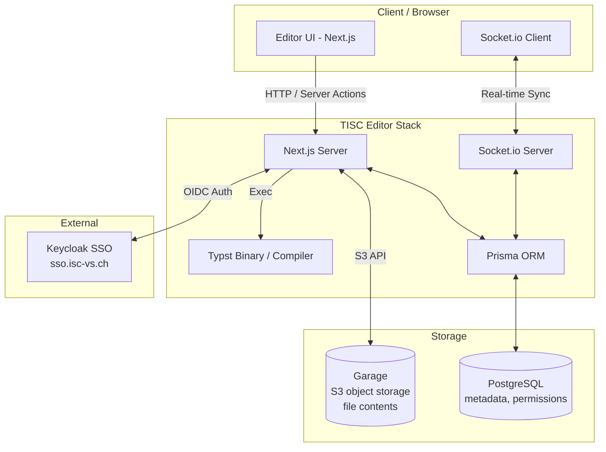

# Architecture Overview

This page gives a high-level overview of how the TISC Editor is built and how its main components interact.

## Diagram



The browser communicates with the Next.js server over HTTP and Server Actions for standard requests, while a dedicated Socket.io connection handles real-time synchronization between clients. On the server side, the Next.js server executes the Typst binary to compile documents and uses Prisma to read and write data in PostgreSQL. The Socket.io server also goes through Prisma to persist collaborative editing state. Authentication is delegated to an external Keycloak instance via OIDC, handled by NextAuth on the server.

The data is split across two stores: PostgreSQL keeps users, permissions and the metadata of each file, while the content of project files is kept in an S3-compatible object store (Garage). The browser never talks to the object store: every read and write goes through the Next.js server, which first checks the user's role in PostgreSQL.

## Object storage

Project files are stored in a private bucket of [Garage](https://garagehq.deuxfleurs.fr/), a lightweight S3-compatible object store that runs as one more container of the stack. The server accesses it through the S3 API (`@aws-sdk/client-s3`), so any S3-compatible service can replace Garage by changing the environment variables.

- **Key format** — `projects/<projectId>/<fileId>`. Deleting a project removes everything under its prefix.
- **Metadata** — path, size, hash, MIME type and storage key of each file are in the `project_files` table (see [Database Schema](./database-schema#projectfile)).
- **Access control** — the bucket is private and not exposed outside the Docker network. Permissions stay in PostgreSQL, which remains the single source of truth.
- **Saves** — the editor sends the whole file tree, and the server uploads only the files whose hash changed.

### Configuration

The application reads these variables from `.env`:

| Variable | Description |
| --- | --- |
| `S3_ENDPOINT` | URL of the S3 API, `http://garage:3900` inside the Docker network |
| `S3_REGION` | Region name, `garage` |
| `S3_BUCKET` | Bucket that holds the project files |
| `S3_FORCE_PATH_STYLE` | `true`: the bucket is addressed in the path, not in the host name |
| `S3_ACCESS_KEY_ID` | Access key, `GK` followed by 24 hexadecimal characters |
| `S3_SECRET_ACCESS_KEY` | Secret key, 64 hexadecimal characters |
| `GARAGE_RPC_SECRET` | Internal secret of the Garage node (read by the `garage` container only) |

Never commit `.env`.

### First start

Garage must be initialized once (storage layout, bucket and access key). The `scripts/garage-init.sh` script does it from the values of `.env` and can safely be run again:

```bash
docker compose -f docker-compose-dev.yml up -d garage
./scripts/garage-init.sh
docker compose -f docker-compose-dev.yml up -d
```

## Tech Stack

### Framework & UI

| Technology | Usage |
| --- | --- |
| [Next.js](https://nextjs.org/) 16 | Application framework (frontend + backend API routes) |
| [React](https://react.dev/) 19 | UI library |
| [TailwindCSS](https://tailwindcss.com/) 4 | Styling |
| [Lucide](https://lucide.dev/) | Icon set |
| [Monaco Editor](https://microsoft.github.io/monaco-editor/) | Code editor component |
| [nextjs-toast-notify](https://www.npmjs.com/package/nextjs-toast-notify) | UI notifications |

### Authentication

| Technology | Usage |
| --- | --- |
| [NextAuth (Auth.js)](https://authjs.dev/) 5 | Authentication framework |
| Keycloak (OIDC) | SSO provider (`sso.isc-vs.ch`) |
| `@auth/prisma-adapter` | Persists sessions and accounts via Prisma |

### Compilation & Documents

| Technology | Usage |
| --- | --- |
| [Typst](https://typst.app/) (`@myriaddreamin/typst-ts-node-compiler`) | Compiles `.typ` files to SVG |
| `jszip` | Generates ZIP archives for project export |

### Real-time Collaboration

| Technology | Usage |
| --- | --- |
| [Socket.io](https://socket.io/) / `socket.io-client` | Real-time sync between collaborators |

### Database

| Technology | Usage |
| --- | --- |
| PostgreSQL | Primary datastore: users, permissions, project and file metadata |
| [Prisma](https://www.prisma.io/) 7 (`@prisma/client`, `@prisma/adapter-pg`) | ORM and database driver |

### Object Storage

| Technology | Usage |
| --- | --- |
| [Garage](https://garagehq.deuxfleurs.fr/) | S3-compatible object store holding the content of project files |
| `@aws-sdk/client-s3` | S3 client used by the server |

### Tooling & DevOps

| Technology | Usage |
| --- | --- |
| TypeScript 5 | Static typing |
| ESLint, Prettier | Linting and formatting |
| Husky, lint-staged | Pre-commit checks |
| Docker Compose | Local and production environments |
| GitHub Actions | CI/CD |
