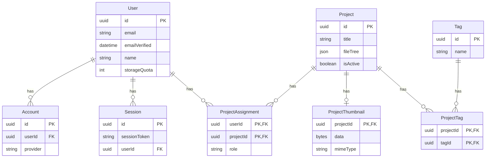

# Database Schema

The database uses **PostgreSQL**, accessed through **Prisma**. The schema is split into three groups: core application models, Auth.js tables, and relation (join) tables.

## Diagram

## Core models

### User

Represents an application user. `storageQuota` is stored in bytes and defaults to `10485760` (10 MB), matching the [storage quota](../../tutorial/storage) described in the user documentation.

A user is linked to their projects through `ProjectAssignment`, rather than through a direct relation — this is what allows a project to be shared with multiple users.

### Project

Represents a project. `fileTree` stores the entire file/folder structure as JSON. `isActive` distinguishes active projects from archived ones.

A project can have one thumbnail, several tags, and several user assignments.

### ProjectThumbnail

Stores the thumbnail image shown on the dashboard, as raw bytes (`data`) with its `mimeType`. It has a one-to-one relation with `Project` and is deleted automatically when the project is (`onDelete: Cascade`).

### Tag

A tag that can be attached to one or more projects, used for categorization and filtering.

## Auth.js tables

These models follow the standard [Auth.js / NextAuth Prisma adapter schema](https://authjs.dev/getting-started/adapters/prisma) and are used to persist authentication data.

- **`Account`** — Stores the link between a `User` and an external OAuth/OIDC provider (Keycloak), including tokens.
- **`Session`** — Stores active sessions, identified by `sessionToken`.
- **`VerificationToken`** — Used for token-based verification flows (e.g. email verification, magic links).

These tables are managed by NextAuth and are not meant to be queried directly outside of the auth flow.

## Relation tables

### ProjectAssignment

Links a `User` to a `Project`, with a `role` of either `"owner"` or `"editor"`. This is the table used to determine who has access to a project and what they can do with it (see [Sharing a project](../../tutorial/projects/sharing)).

The composite primary key `[userId, projectId]` ensures a user can only have a single role on a given project.

### ProjectTag

Links a `Project` to a `Tag`, allowing many-to-many tagging. The composite primary key `[projectId, tagId]` prevents duplicate tag assignments.