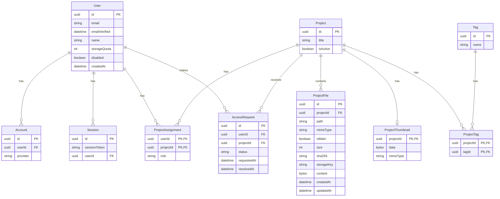

# Database Schema

The database uses **PostgreSQL**, accessed through **Prisma**. It stores users, permissions and file **metadata**; the **content** of project files lives in an S3-compatible object store (see [Object storage](./architecture#object-storage)). The schema is split into three groups: core application models, Auth.js tables, and relation (join) tables.

## Diagram


```mermaid
erDiagram
    User {
        uuid id PK
        string email
        datetime emailVerified
        string name
        int storageQuota
        boolean disabled
        datetime createdAt
    }
    Project {
        uuid id PK
        string title
        boolean isActive
    }
    ProjectFile {
        uuid id PK
        uuid projectId FK
        string path
        string mimeType
        boolean isMain
        int size
        string sha256
        string storageKey
        bytes content
        datetime createdAt
        datetime updatedAt
    }
    ProjectThumbnail {
        uuid projectId PK, FK
        bytes data
        string mimeType
    }
    Tag {
        uuid id PK
        string name
    }
    AccessRequest {
        uuid id PK
        uuid userId FK
        uuid projectId FK
        string status
        datetime requestedAt
        datetime resolvedAt
    }
    Account {
        uuid id PK
        uuid userId FK
        string provider
    }
    Session {
        uuid id PK
        string sessionToken
        uuid userId FK
    }
    ProjectAssignment {
        uuid userId PK, FK
        uuid projectId PK, FK
        string role
    }
    ProjectTag {
        uuid projectId PK, FK
        uuid tagId PK, FK
    }

    User ||--o{ Account : has
    User ||--o{ Session : has
    User ||--o{ ProjectAssignment : has
    User ||--o{ AccessRequest : makes
    Project ||--o{ ProjectAssignment : has
    Project ||--o{ AccessRequest : receives
    Project ||--o{ ProjectFile : contains
    Project ||--o| ProjectThumbnail : has
    Project ||--o{ ProjectTag : has
    Tag ||--o{ ProjectTag : has
```

## Core models

### User

Represents an application user. `storageQuota` is stored in bytes and defaults to `10485760` (10 MB), matching the [storage quota](../../tutorial/storage) described in the user documentation. The quota is checked against the total `size` of the files of the projects the user owns (see [ProjectFile](#projectfile)).

`disabled` (default `false`) blocks the user from signing in: the `signIn` callback refuses disabled accounts and redirects to the login page with an `AccountDisabled` error. `createdAt` records the creation date of the account.

A user is linked to their projects through `ProjectAssignment`, rather than through a direct relation — this is what allows a project to be shared with multiple users. A user can also have pending or past [access requests](#accessrequest).

### Project

Represents a project. `isActive` distinguishes active projects from archived ones.

A project does not store its files directly: they are described by [`ProjectFile`](#projectfile) rows, and their content is kept in the object store. A project can also have one thumbnail, several tags, several user assignments and several access requests.

### ProjectFile

Describes one file of a project (a `.typ` source, an image, a font, and so on). The table holds only metadata; the bytes are stored in the object store under `storageKey`.

| Column | Type | Description |
| --- | --- | --- |
| `id` | `uuid` | Primary key. Also the last segment of the storage key |
| `projectId` | `uuid` | The project the file belongs to |
| `path` | `string` | Full path inside the project, for example `src/main.typ`. Folders are not stored: they are implied by the paths |
| `mimeType` | `string` | `text/plain` for text files, the real MIME type (`image/png`, …) for binary files |
| `isMain` | `boolean` | Marks the entry file of the project |
| `size` | `int` | Size of the stored content in bytes. This is the value used for the storage quota |
| `sha256` | `string?` | Hash of the content. Lets a save skip files that did not change |
| `storageKey` | `string?` | Object key in the bucket, `projects/<projectId>/<fileId>`. `null` only for files not migrated yet |
| `content` | `bytes?` | Legacy inline content. `null` once the file has been moved to the object store |
| `createdAt` / `updatedAt` | `datetime` | Creation and last modification dates |

The unique constraint on `[projectId, path]` guarantees one file per path in a project, and doubles as the index used to list a project's files. Rows are deleted automatically when the project is deleted (`onDelete: Cascade`); the matching objects are removed by the application, since the database cannot do it.

The table is named `project_files` in the database (`@@map`), with snake_case columns (`project_id`, `mime_type`, `is_main`, `storage_key`, `created_at`, `updated_at`).

#### File tree and binary files

The rest of the application still works with a `fileTree` (nested folders and files). It is no longer stored: it is **rebuilt on load** from the `ProjectFile` rows, and **flattened on save** into one row per file.

Text files are stored as UTF-8. Binary files travel in the tree as base64 `data:` URLs; on save they are decoded into real bytes (with their MIME type) before being stored, and re-encoded when the project is loaded. As a result, `size` and the quota reflect the real size of the files.

#### Consistency between the database and the object store

The two stores cannot share a transaction, so writes follow a fixed order:

- **Create / save / duplicate** — objects are uploaded first, then the rows are written. A failure in between leaves unreferenced objects, which are harmless, but never a row pointing to a missing object.
- **Delete** — rows are deleted first, then the objects (best effort).
- **Load** — a missing object makes the load fail instead of returning an empty file, so that a later save cannot overwrite real data with nothing.

### ProjectThumbnail

Stores the thumbnail image shown on the dashboard, as raw bytes (`data`) with its `mimeType`. It has a one-to-one relation with `Project` and is deleted automatically when the project is (`onDelete: Cascade`). Thumbnails are still stored in the database.

### Tag

A tag that can be attached to one or more projects, used for categorization and filtering.

### AccessRequest

Stores a request made by a user to access a project they are not assigned to. See [Access Requests](../core-systems/access-requests.md) for the full flow.

| Column | Type | Description |
| --- | --- | --- |
| `id` | `uuid` | Primary key. It is the identifier used in the owner's review link (`/access-requests/<id>`) |
| `userId` | `uuid` | The user asking for access |
| `projectId` | `uuid` | The project they want to open |
| `status` | `string` | `"pending"` (default), `"approved"` or `"denied"` |
| `requestedAt` | `datetime` | Date of the last request. Used for the 24 h cooldown between two requests |
| `resolvedAt` | `datetime?` | Date of the owner's decision. `null` while pending |

The unique constraint on `[userId, projectId]` allows **one request per user and project**: asking again updates the existing row instead of creating a new one. Rows are deleted automatically when the user or the project is deleted (`onDelete: Cascade`).

An approved request does not grant access by itself: access is given by the `ProjectAssignment` created at the same time. The `AccessRequest` row is only a record of the request and its outcome.

The table is named `access_requests` in the database (`@@map`), with snake_case columns (`user_id`, `project_id`, `requested_at`, `resolved_at`).

## Auth.js tables

These models follow the standard [Auth.js / NextAuth Prisma adapter schema](https://authjs.dev/getting-started/adapters/prisma) and are used to persist authentication data.

- **`Account`** — Stores the link between a `User` and an external OAuth/OIDC provider (Keycloak), including tokens.
- **`Session`** — Stores active sessions, identified by `sessionToken`.
- **`VerificationToken`** — Used for token-based verification flows (e.g. email verification, magic links).

These tables are managed by NextAuth and are not meant to be queried directly outside of the auth flow.

## Relation tables

### ProjectAssignment

Links a `User` to a `Project`, with a `role` of either `"owner"`, `"editor"` or `"viewer"`. This is the table used to determine who has access to a project and what they can do with it (see [Sharing a project](../../tutorial/projects/sharing)).

The composite primary key `[userId, projectId]` ensures a user can only have a single role on a given project.

### ProjectTag

Links a `Project` to a `Tag`, allowing many-to-many tagging. The composite primary key `[projectId, tagId]` prevents duplicate tag assignments.

## Naming

The Prisma models use PascalCase names, but the tables and columns use snake_case through `@map` / `@@map` (for example `ProjectAssignment` is the `project_assignments` table, with `user_id` and `project_id` columns). Use the **table names** in raw SQL:

```bash
docker exec <db-container> psql -U <user> -d <database> -c 'SELECT * FROM users LIMIT 5;'
```

To check where the files of a project are stored:

```sql
SELECT path, mime_type, size, storage_key FROM project_files WHERE project_id = '<project-id>';
```
