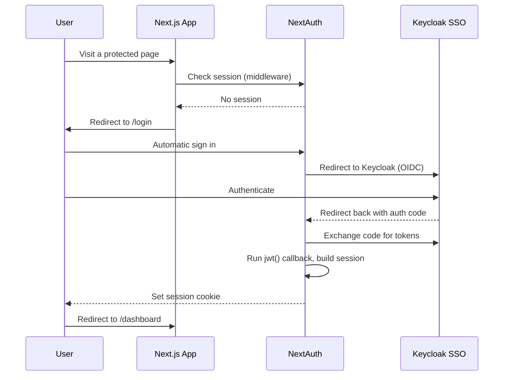

# Authentication & SSO

Authentication is handled by **NextAuth (Auth.js) v5**, using **Keycloak** as the OIDC identity provider.

## Login flow

## Configuration files

Authentication logic is split into two files:

- **`lib/auth.ts`** — The full NextAuth configuration, including the Keycloak provider, the Prisma adapter, and the callbacks that shape the token and session. This is used in server components, API routes, and server actions.
- **`lib/auth.config.ts`** — A lightweight subset of the configuration, containing only the `authorized` callback and the sign-in page. This is the configuration used by the **middleware**, which runs on the Edge runtime and cannot use the Prisma adapter or Node-only dependencies.

## Session strategy

Sessions use the **JWT** strategy rather than database sessions. This means the session state is stored in a signed cookie instead of a `Session` row being checked on every request, which keeps route protection fast in the middleware (Edge runtime).

The Prisma adapter is still used to persist `User` and `Account` records on first login, even though sessions themselves are not stored in the database.

## Callbacks

### `jwt`

Runs when a JWT is created or updated. On initial sign-in (when `account` and `user` are available), it enriches the token with:

- `token.id` — the internal user ID
- `token.groups` — the Keycloak groups from the user's `profile`

### `session`

Runs whenever the session is read. It copies `id` and `groups` from the token onto `session.user`, making them available on the client and in server components via `auth()`.

### `authorized`

Used by the middleware to decide whether a request is allowed to proceed, based on the route and the session state:

- API routes (`/api/*`) and the login page are always allowed through.
- Any other route requires a logged-in user, otherwise the request is denied and Next.js redirects to `/login`.
- If a logged-in user tries to access `/login`, they are redirected to `/dashboard` instead.