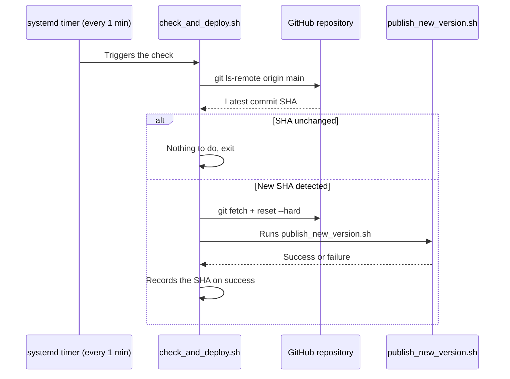

# Automatic Deployment

This document describes the automatic deployment mechanism for **tisc-editor** on the production LXC. The system watches the `main` branch of the repository and automatically runs `publish_new_version.sh` whenever a new commit is detected.

## Why this approach

The LXC is not reachable from GitHub Actions (no inbound connection is possible). Rather than pushing a deployment from CI, the LXC **periodically polls** the remote repository to check whether `main` has changed. If it has, it pulls the new code and runs the publish script.

This approach was chosen over building Docker images via a CI workflow (see issue [#105](https://github.com/ISC-HEI/tisc-editor/issues/105)), since it requires no inbound connection to the LXC and is simple to set up.

## How it works



1. A **systemd timer** triggers `check_and_deploy.sh` every minute.
2. The script compares the remote SHA of `main` (`git ls-remote`) with the last deployed SHA, stored in `/var/lib/tisc-editor/last_deployed_sha`.
3. If nothing has changed, the script exits immediately (no unnecessary load).
4. If a new commit is detected:
   - `git fetch` + `git reset --hard origin/main` pulls the up-to-date code.
   - `publish_new_version.sh` is executed.
   - On success, the new SHA is recorded as the "last deployed" one.
   - On failure, the SHA is **not** recorded, so the deployment is automatically retried on the next tick.
5. A lock file (`flock`) prevents two runs from overlapping if a deployment takes longer than a minute.

## File locations

| File | Purpose |
|---|---|
| `/root/tisc-editor/scripts/check_and_deploy.sh` | Main check/deploy script |
| `/etc/systemd/system/tisc-deploy-check.service` | systemd unit running the script |
| `/etc/systemd/system/tisc-deploy-check.timer` | systemd timer triggering the service every minute |
| `/var/lib/tisc-editor/last_deployed_sha` | State: SHA of the last successful deployment |
| `/var/lock/tisc-editor-deploy.lock` | Anti-overlap lock |

## Installation on the LXC

```bash
# Create the state directory
mkdir -p /var/lib/tisc-editor

# Install the systemd units
cp /root/tisc-editor/scripts/tisc-deploy-check.service /etc/systemd/system/
cp /root/tisc-editor/scripts/tisc-deploy-check.timer /etc/systemd/system/

# Reload systemd and enable the timer
systemctl daemon-reload
systemctl enable --now tisc-deploy-check.timer
```

## Checking that it's running

```bash
# See the next scheduled run
systemctl list-timers tisc-deploy-check.timer

# Trigger an immediate manual check
systemctl start tisc-deploy-check.service

# Follow the logs live
journalctl -t tisc-deploy -f
```

## Forcing a redeploy

To force a redeploy even if the code hasn't changed (for example after a manual change on the server), simply delete the state file before re-running the check:

```bash
rm /var/lib/tisc-editor/last_deployed_sha
systemctl start tisc-deploy-check.service
```

## Known limitations

- Deployment can take up to a minute after the push, since it waits for the timer to fire.
- A failure in `publish_new_version.sh` is automatically retried on every tick until the underlying issue is fixed — keep an eye on the logs if you see repeated failures.
