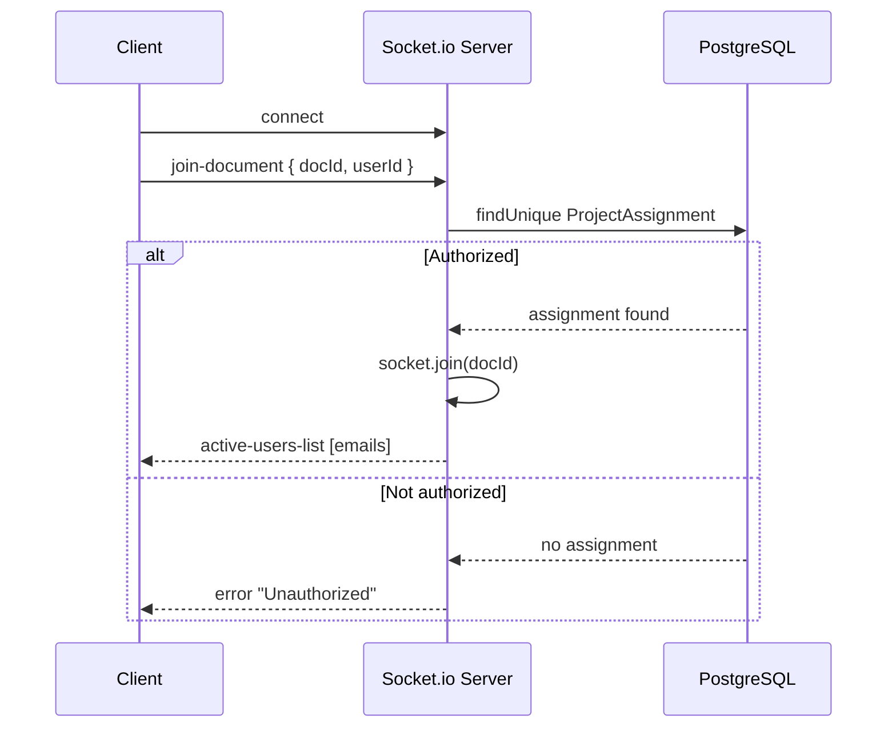

# Real-time Collaboration

Real-time collaboration is implemented with **Socket.io**, on top of the WebSocket server initialized in [`/api/ws`](./api-endpoints#get-apiws)). The server-side logic lives in `lib/socketServer.ts`; the client-side logic lives in the `useTypstCollaboration` hook, used by the editor.

## Connecting and joining a document

A socket connection alone does not grant access to a project. After connecting, the client must explicitly join a document by emitting `join-document` with a `docId` (the project ID) and `userId`. The server then checks whether that user has a `ProjectAssignment` for that project before allowing the join — if not, it responds with an `error` event instead.

Once joined, the socket is stored server-side with an in-memory session (`{ userId, docId, authorized, email }`). Every subsequent event from that socket is checked against `session.authorized && session.docId === docId` before being relayed — the server does not re-query the database on every edit, it trusts the authorization established at join time for the lifetime of the connection.

## Events reference

### Client → Server

| Event | Payload | Description |
| --- | --- | --- |
| `join-document` | `{ docId, userId }` | Authorizes and joins a project's collaboration room |
| `edit-file` | `{ docId, filename, changes }` | Broadcasts a Monaco content change |
| `cursor-change` | `{ docId, filename, selection }` | Broadcasts the local cursor position / selection |
| `create-node` | `{ docId, path, type }` | Broadcasts file/folder creation |
| `rename-node` | `{ docId, oldPath, newPath }` | Broadcasts a rename |
| `delete-node` | `{ docId, path }` | Broadcasts a deletion |
| `set-main-file` | `{ docId, path }` | Broadcasts a change of the main compiled file |

### Server → Client

| Event | Payload | Description |
| --- | --- | --- |
| `active-users-list` | `string[]` (emails) | Full list of currently active, unique users on the document |
| `remote-edit` | `{ filename, changes, userId }` | A file change made by another collaborator |
| `remote-cursor` | `{ filename, selection, userId, email }` | Another collaborator's cursor/selection |
| `node-created` / `node-renamed` / `node-deleted` | path-related fields | A file system change made by another collaborator |
| `remote-set-main` | `{ path }` | The main file was changed by another collaborator |
| `error` | `string` | Authorization or connection error |

All server → client events except `active-users-list` are relayed with `socket.to(docId).emit(...)`, meaning the sender of the original action never receives their own event back.

## Presence

The server keeps an in-memory map of active users per document (`activeUsers[docId][socketId] = email`). Because a user can have multiple sockets open (e.g. two tabs), the list sent to clients is deduplicated by email before being broadcast. On the client, joining and leaving triggers toast notifications, computed by diffing the new user list against the previous one.

## Remote cursors and selections

Cursor and selection data is rendered using Monaco's `deltaDecorations` API. Each collaborator is assigned a deterministic color derived from their email (`stringToColor`), used consistently for their cursor, their selection highlight, and their name label. A cursor is only rendered if the remote user is currently viewing the **same file** as the local user; switching files clears their decorations from the editor.

## Content synchronization

Local edits are sent immediately over `edit-file` as Monaco change objects (range + text), not full file contents. On the receiving end, changes are applied two ways depending on whether the affected file is currently open:

- If it is the file currently open in the editor, the changes are converted into Monaco edit operations and applied directly to the live model (preserving the undo stack).
- If it is a different file, the change is applied to the in-memory file tree as plain text (`applyMonacoChangesToString`), so it stays consistent even though it's not rendered.

After any remote edit, a **debounced recompile** (1 second) is triggered to refresh the preview.

:::info[No operational transform]

Changes are currently relayed as raw Monaco diffs and applied in the order they are received, with no conflict-resolution algorithm (such as OT or CRDT). A mutex-based synchronization mechanism is planned to prevent concurrent edits from being applied simultaneously. This will be implemented at a later stage as the system evolves.

:::

## File tree structural changes

Creating, renaming, deleting a file/folder, and changing the main file are broadcast the same way as content edits: the acting client applies the change locally first, then emits the corresponding event so other clients replay it on their own copy of the tree.