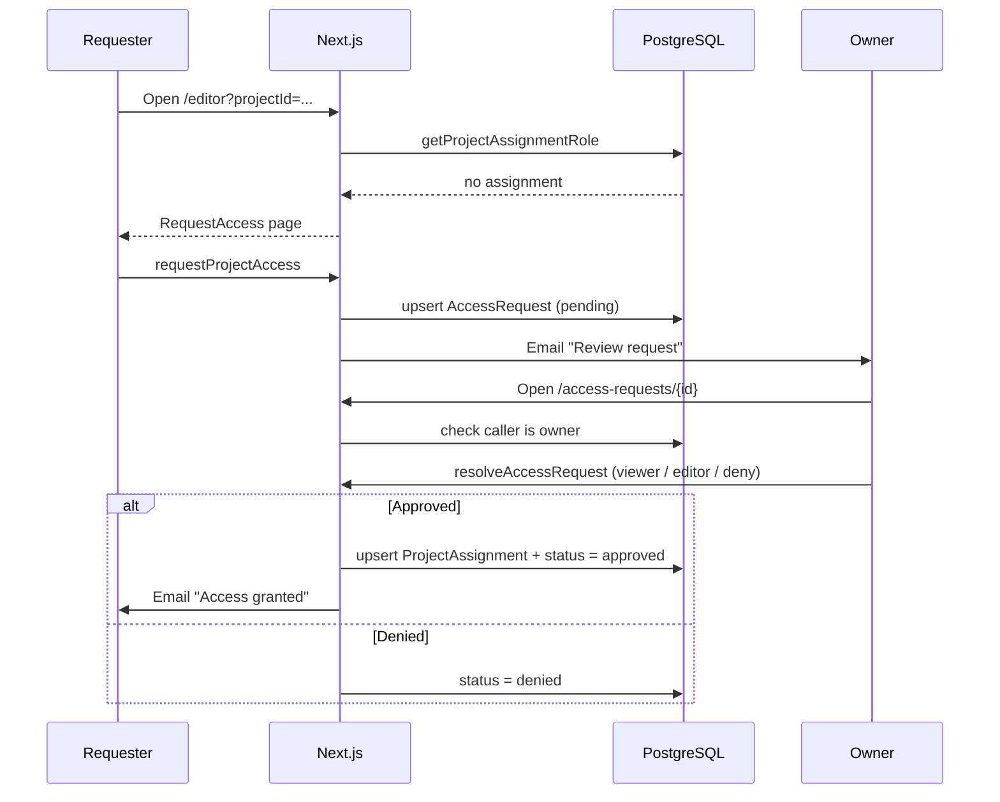

# Access Requests

When a user opens a project they are not assigned to (for example from a link shared outside the app), they land on an **access request page** instead of being redirected. From there they can ask the project owner for access. The owner receives an email with a button leading to a **review page**, where they grant `viewer` or `editor` access, or deny the request.

For the end-user point of view, see [Requesting access to a project](../../tutorial/projects/request-access.md).

## Overview

| Aspect | Details |
| --- | --- |
| Data | `AccessRequest` table (see [Data model](#data-model)) |
| Server Actions | `requestProjectAccess`, `resolveAccessRequest` in `lib/actions/access-requests.ts` |
| Pages | Editor page (`?projectId=...`) → `RequestAccess` fallback, and `/access-requests/[id]` for the owner's review |
| Components | `components/Dashboard/RequestAccess.jsx` |
| Emails | One to the owner on request, one to the requester on approval (see [Emails](#emails)) |
| Who can resolve a request | The project `owner` only |

## Flow



## Why the email does not grant access directly

The email button opens a page; it never grants access by itself. Two reasons:

- **Link scanners.** Mail security tools (Safe Links, antivirus) automatically open links in emails. An action triggered by a simple `GET` would be executed without the owner's intervention.
- **Link leakage.** A link containing a secret token would give access to anyone who obtains it (forwarded email, shared mailbox).

Instead, the review page requires the caller to be **signed in and owner of the project**, and the decision is made with a form submission (Server Action, `POST`). No token is involved.

## Server Actions

### `requestProjectAccess(prevState, formData)`

Creates or renews an access request and notifies the owner. Designed to be used with `useActionState`: it receives the previous state and a `FormData` containing `projectId`, and returns `{ success?: boolean; error?: string }`.

#### Rules applied when requesting

| Situation | Result |
| --- | --- |
| `projectId` is not a valid UUID | `error: 'Invalid project'` |
| Project does not exist | `success: true`, nothing is sent (see [Information disclosure](#security)) |
| Caller already has an assignment | `error: 'You already have access to this project'` |
| Previous request was `denied` | `error: 'Your previous request was declined by the owner'` |
| A `pending` request was made less than 24 h ago | `error: 'You already requested access. The owner has been notified.'` |
| Otherwise | Request is created or reset to `pending`, `requestedAt` is updated, email is sent, `success: true` |

A `pending` request older than 24 h can be renewed, which sends a new email to the owner. A user who was approved and later removed from the project can also ask again: the `approved` row is reset to `pending`.

### `resolveAccessRequest(requestId, decision)`

Approves or denies a request. `decision` is `'viewer'`, `'editor'` or `'deny'`.

| Step | Detail |
| --- | --- |
| Authentication | `requireUserId()` |
| Input validation | `requestId` must be a UUID and `decision` one of the three values. Server Actions can be called directly from the client, so this is checked server-side |
| Authorization | `requireOwnerAssignment(userId, request.projectId, 'Only the owner can handle access requests')` |
| State check | Throws `This request has already been handled` unless the status is `pending` |
| `deny` | Sets `status = 'denied'` and `resolvedAt`. No email is sent |
| `viewer` / `editor` | In a **transaction**: `upsert` of the `ProjectAssignment` with the chosen role, and `status = 'approved'`. Then sends the confirmation email |

The `upsert` of the assignment uses an empty `update`: if the user was shared the project by another route in the meantime, their existing role is **not** overwritten.

Errors thrown: `Invalid request`, `Request not found`, `Only the owner can handle access requests`, `This request has already been handled`.

## Pages and components

### Editor page

The editor page checks the caller's role **before** loading the project. If there is no assignment, it renders `RequestAccess` instead of redirecting to the dashboard:

```tsx
const role = await getProjectAssignmentRole(projectId);

if (!role) {
  return <RequestAccess projectId={projectId} email={session.user.email} />;
}
```

A `projectId` that is not a UUID returns a 404 (`notFound()`), because the database column is of type `uuid` and an invalid value would make Prisma throw.

`getProjectAssignmentRole` must return `null` (not throw) when there is no assignment.

### `RequestAccess`

Client component (`'use client'`) displaying the "You need access" page, in the style of the other error pages.

| Prop | Type | Description |
| --- | --- | --- |
| `projectId` | `string` | Project the user tried to open |
| `email` | `string \| null` | Email of the signed-in user, shown so they can notice they are using the wrong account |

It calls `requestProjectAccess` through `useActionState`, disables the button while sending, and displays either a success message or the error returned by the action. After a successful request, the button is hidden.

The page deliberately shows **no project title or owner**.

### Review page: `/access-requests/[id]`

Server component for the owner.

| Case | Behavior |
| --- | --- |
| Not signed in | Redirects to `/login?callbackUrl=/access-requests/<id>`, so the owner returns to the page after signing in |
| `id` is not a UUID | 404 |
| Request not found | 404 |
| Caller is not the owner of the project | **404** (not 403, to avoid revealing that the request exists) |
| Request is `pending` | Shows the requester and three buttons: **Grant viewer access**, **Grant editor access**, **Deny** |
| Request already handled | Shows its status and a link back to the dashboard |

Each button is a form bound to `resolveAccessRequest` (`action={resolveAccessRequest.bind(null, id, 'viewer')}`). After the action, `revalidatePath` re-renders the page with the new status.

## Emails

Both emails are sent with [`sendMail`](./emails#sendmailto-subject-message-options).

| Email | Sent when | Recipient | Label | Code box | Button |
| --- | --- | --- | --- | --- | --- |
| Access request | `requestProjectAccess` succeeds | Project owner | `ACCESS REQUEST` | `pending approval` | **Review request** → `/access-requests/<id>` |
| Access granted | `resolveAccessRequest` with `viewer` or `editor` | Requester | `ACCESS GRANTED` | `viewer access granted` / `editor access granted` | **Open the project** → editor page  |

No email is sent when a request is denied. 

:::warning[`AUTH_URL`]

Button links are built from `AUTH_URL`. If it is missing or still set to `http://localhost:3000`, the owner receives a broken link. See [Emails](./emails#configuration).

:::

## Security

- **Owner-only resolution.** The ownership check runs both when rendering the review page and inside `resolveAccessRequest`. The request `id` in the URL is not a secret; the server-side role check is what protects it.
- **Information disclosure.** Requesting access to a project that does not exist returns the same result as a successful request, and the review page returns a 404 to anyone but the owner. This prevents users from guessing which project IDs exist.
- **No access through email.** Opening the link or having it forwarded grants nothing: the recipient must be signed in as the owner.
- **Spam protection.** One row per user and project, plus a 24 h cooldown on re-requests, limits the emails an owner can receive from a single user.

## Limitations

- **No in-app notification.** Owners are only notified by email. There is no list of pending requests in the dashboard. 
- **Email failures are silent.** If the email to the owner cannot be sent, the user still sees "Request sent". See [Error handling](./emails#error-handling).
- **No expiration.** A `pending` request stays valid indefinitely.
- **Denied is final.** A denied user cannot ask again.
- **Single owner.** The email goes to the single project owner. Editors cannot handle requests (see [Roles & Permissions](./role-permissions)).
