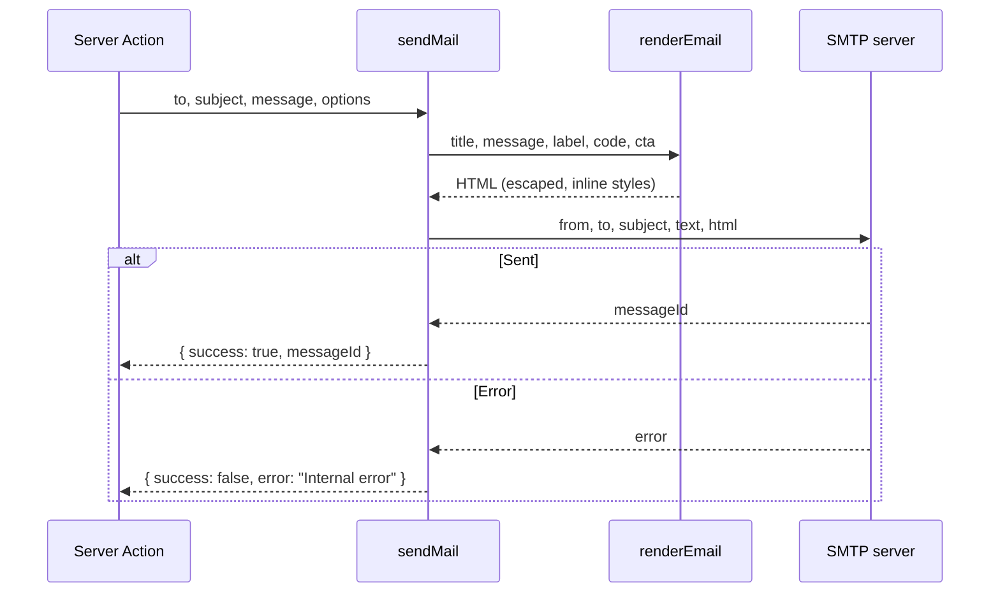

# Emails

The application sends transactional emails (project sharing, ownership transfer) through SMTP, using [Nodemailer](https://nodemailer.com/). Emails are sent from [Server Actions](./server-actions), never from the client.

Every email uses the same HTML layout, which mirrors the style of the app's error pages (monospace label, large title, short message, optional "code" box and optional button). The layout is generated by a single function, `renderEmail`, so a new email only needs to provide its content.

## Overview

| Aspect | Details |
| --- | --- |
| Defined in | `lib/email.ts` (`sendMail`, SMTP transport), `lib/email-template.ts` (`renderEmail`, HTML layout) |
| Transport | SMTP via Nodemailer |
| SMTP provider | Infomaniak (`mail.infomaniak.com`) |
| Format | HTML + plain-text fallback (`text`) |
| Sent from | Server Actions only |
| Failure behavior | Never throws: `sendMail` returns `{ success: false }` and the calling action continues (see [Error handling](#error-handling)) |

## Emails sent by the app

| Email | Triggered by | Recipient | Label | Code box | Button |
| --- | --- | --- | --- | --- | --- |
| Project shared | [`shareProject`](./server-actions#shareprojectprojectid-shareduseremail-canedit--false) | The user the project is shared with | `SHARING` | `editor access granted` or `viewer access granted` | **Open the project** → `/dashboard` |
| Ownership transferred | [`transferProjectOwnership`](./server-actions#transferprojectownershipprojectid-newowneremail) | The new owner | `OWNERSHIP` | `ownership transferred` | **Open the project** → `/dashboard` |
| Access request | [`requestProjectAccess`](./server-actions#requestprojectaccessprevstate-formdata) | The project owner | `ACCESS REQUEST` | `pending approval` | **Review request** → `/access-requests/<id>` |
| Access granted | [`resolveAccessRequest`](./server-actions#resolveaccessrequestrequestid-decision) (`viewer` or `editor`) | The user who requested access | `ACCESS GRANTED` | `viewer access granted` or `editor access granted` | **Open the project** → editor page |

No email is sent when an access request is denied. See [Access Requests](./access-requests#emails).

:::info[Link target]

The sharing and ownership buttons currently point to `/dashboard`, not directly to the project.

:::

## Configuration

The transport is configured entirely through environment variables:

| Variable | Description | Example |
| --- | --- | --- |
| `SMTP_HOST` | SMTP server hostname | `mail.infomaniak.com` |
| `SMTP_PORT` | SMTP port. Defaults to `587` if unset | `587` |
| `SMTP_USER` | SMTP login | `tisc@isc-vs.ch` |
| `SMTP_PASS` | SMTP password | *(secret)* |
| `SMTP_FROM` | Address shown in the `From` header | `tisc@isc-vs.ch` |
| `AUTH_URL` | Public base URL of the app, used to build the button links | `https://<domain>` <!-- TODO: production URL --> |

- **Port and TLS.** `secure` is enabled only when `SMTP_PORT` is `465` (implicit TLS). On `587`, Nodemailer upgrades the connection with STARTTLS.
- **Transporter reuse.** The transporter is created once, when the module is loaded, so the SMTP connection settings are reused across sends. Changing an environment variable therefore requires restarting (recreating) the container.

:::warning[`AUTH_URL` must be the public URL]

Button links are built as `${process.env.AUTH_URL}/dashboard`. If `AUTH_URL` is not available in the container, the link becomes `undefined/dashboard`. If it is left to the default from `.env.example` (`http://localhost:3000`), recipients receive a link to `localhost`. See [Troubleshooting](#troubleshooting).

:::

## Sending an email

### `sendMail(to, subject, message, options?)`

```ts
await sendMail(
  user.email,
  'A project has been shared with you',
  'Adrien shared the project "Demo" with you.',
  {
    label: 'SHARING',
    code: 'editor access granted',
    cta: { label: 'Open the project', url: `${process.env.AUTH_URL}/dashboard` },
  },
);
```

| Parameter | Type | Description |
| --- | --- | --- |
| `to` | `string` | Recipient address |
| `subject` | `string` | Email subject. Also used as the title if `options.title` is not provided |
| `message` | `string` | Body text. Used both as the plain-text version and inside the HTML layout |
| `options.title` | `string` | Large heading. Defaults to `subject` |
| `options.label` | `string` | Small monospace text above the title. Defaults to `TISC` |
| `options.code` | `string` | Text shown in the monospace box (`#info: <code>`). The box is hidden if omitted |
| `options.cta` | `{ label: string; url: string }` | Button shown under the message. Hidden if omitted |

**Returns** `Promise<{ success: boolean; messageId?: string; error?: string }>`.

### `renderEmail(options)`

Builds the HTML string. It takes the same fields as above (`title`, `message`, `label`, `code`, `cta`) and is called by `sendMail`, so it rarely needs to be used directly.



## Template

The layout is built for email clients, which do not support Tailwind or external stylesheets:

- **Inline styles and `<table>` layout.** Required for consistent rendering in Gmail and Outlook.
- **System font stacks.** Web fonts are unreliable in mail clients, so a system monospace stack (label and code box) and a system sans-serif stack (everything else) are used.
- **Escaped content.** `title`, `message`, `label`, `code` and the button label/URL are HTML-escaped. User-controlled values (project name, user name) can be passed safely. Line breaks (`\n`) in `message` become `<br />`.
- **Plain-text fallback.** `message` is also sent as the `text` version, without the label, code or button.

:::info[HTML in `message`]

Since `message` is escaped, passing HTML in it displays the tags as text. If a caller ever needs rich content, an explicit opt-in option would have to be added to `renderEmail`.

:::

:::info[Outlook]

Rounded corners (`border-radius`) are ignored by some older versions of Outlook, which display square corners instead. The rest of the layout is unaffected.

:::

## Adding a new email

1. Call `sendMail` from a Server Action, **after** the database change has succeeded.
2. Pick a short uppercase `label` that describes the type of email (`SHARING`, `OWNERSHIP`, ...).
3. Use `code` for a one-line status in the monospace box, and `cta` for the main action.
4. Build links from `AUTH_URL`. Do not hardcode a domain.
5. Add a row to the [table above](#emails-sent-by-the-app).

## Error handling

`sendMail` catches every error, logs it with `console.error('Error during mail sending:', error)` and returns `{ success: false, error: 'Internal error' }`.

The current Server Actions **do not check the result**: if the email fails, the share or the ownership transfer has already been saved and the action still returns `{ success: true }`. The recipient simply does not get notified.

## Troubleshooting

| Symptom | Likely cause | Fix |
| --- | --- | --- |
| Button link is `undefined/dashboard` | `AUTH_URL` is not defined in the container's environment | Make sure it is passed through `env_file:` / `environment:` in `docker-compose.yml`, then recreate the container with `docker compose up -d --force-recreate` |
| Button link points to `http://localhost:3000` | `AUTH_URL` still has the development value | Set the public URL in the production `.env`, without a trailing slash |
| Email does not arrive, `Error during mail sending` in the logs | Wrong SMTP credentials, host or port, or blocked outbound connection | Check `SMTP_*` variables and the container's outbound access to the SMTP port |
| Check the variable inside the container | | `docker exec <app-container> printenv \| grep -E 'AUTH_URL\|SMTP'` |

## Limitations

- **No retry or queue.** An email is sent synchronously during the action; if the SMTP server is down, it is lost.
- **Action latency.** The action waits for the SMTP exchange before returning, which adds to the response time.
- **No delivery tracking.** Only the SMTP acceptance (`messageId`) is known, not whether the message was actually delivered or read.
