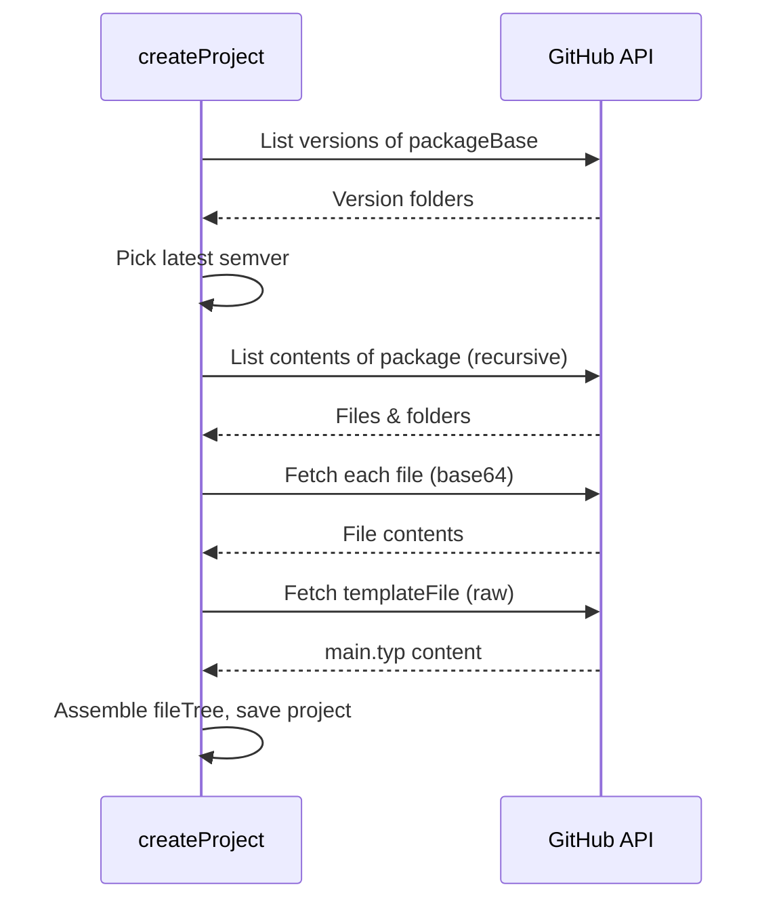

# Templates Management

Project templates (the ones shown in the [template gallery](../../tutorial/projects/create#templates)) are declared in `lib/templates.tsx` and fetched from GitHub at project creation time.

## Declaring a template

Templates are defined as a plain array, `TEMPLATES`, in `lib/templates.tsx`:

```tsx
export const TEMPLATES = [
  {
    id: 'isc-hei-report',
    packageBase: 'isc-hei-report',
    packageSubPath: 'src',
    name: 'ISC-HEI Report',
    description: 'Official template for project report',
    templateFile: 'report.typ',
    icon: <ClipboardList className="text-amber-500" size={32} />,
  },
  // ...
];
```

| Field | Description |
| --- | --- |
| `id` | Unique identifier for the template (used as the form value in the UI) |
| `packageBase` | Name of the corresponding package in the [`typst/packages`](https://github.com/typst/packages) repository, under `packages/preview/` |
| `packageSubPath` | Optional subfolder inside the package to import from (e.g. `src`) |
| `name` | Display name in the template gallery |
| `description` | Short description shown under the name |
| `templateFile` | Path (relative to `packageSubPath`, if set) of the `.typ` file used as the project's main file |
| `icon` | A `lucide-react` icon component shown in the gallery |

The special `blank` entry (`packageBase: 'blank'`) is handled separately: it does not go through GitHub at all and simply creates a project with an empty `main.typ`.

:::info[Adding a new template]

To add a new official template, add an entry to `TEMPLATES` pointing to an existing package under [`typst/packages/preview`](https://github.com/typst/packages/tree/main/packages/preview). The package must already be published there — this file does not publish or host templates, it only references them.

:::

## How templates are fetched

When a project is created from a template (`createProject` server action), the following happens:

1. **Resolve the latest version** — `getLatestVersion(packageBase)` lists the version folders under `packages/preview/<packageBase>` in the `typst/packages` GitHub repo and returns the highest semver one.
2. **Build the package path** — the final package identifier combines the base name, the resolved version, and the optional subpath: `<packageBase>/<version>[/<packageSubPath>]`.
3. **Download the file tree** — `importPackageAsTree` recursively walks the package's GitHub contents (`buildTreeFromGitHub`) and downloads every file as base64 (`getFileContentAsBase64`), reconstructing the same folder/file structure used by the editor's file tree.
4. **Set the main file** — the template's entry file (`templateFile`) is fetched separately from `raw.githubusercontent.com` and inserted into the tree as `main.typ`, marked as the main file (`isMain: true`).



## Filtering

While walking the package's files, `buildTreeFromGitHub` skips:

- Hidden files/folders (names starting with `.`)
- `.md` files
- `LICENSE`
- The template's own entry file (`templateFile`), since it is fetched and inserted separately as `main.typ`

## Rate limiting

Every step above calls the GitHub REST API. Without a configured `GITHUB_TOKEN`, this is limited to 60 requests/hour per IP, which is easily exceeded — see [Configuration](../configuration#github) for setting up a token.

## Quota enforcement

Before the project is actually created, the size of the generated `fileTree` is checked against the user's storage quota (`checkUserQuota`), the same mechanism used by [`/api/projects/save`](./api-endpoints#post-apiprojectssave). If the quota would be exceeded, project creation is aborted before any database write happens.